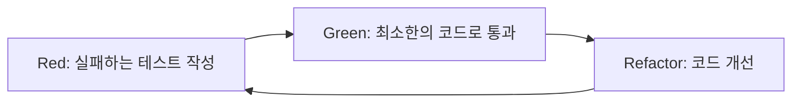

# TDD (Test-Driven Development) 규칙

## 개요
이 프로젝트의 **코어 로직**은 TDD(테스트 주도 개발) 방식으로 구현합니다.
UI 컴포넌트는 TDD 대상에서 제외되며, 비즈니스 로직과 계산 엔진에 집중합니다.

## TDD 적용 범위

### ✅ TDD 적용 대상 (자동화 테스트)
- **계산 엔진** (`calculator.js`)
  - 사칙연산 로직
  - 과학 함수 계산
  - 표현식 파싱 및 평가
  - 연산자 우선순위 처리
  
- **상태 관리** (`state.js`)
  - 계산기 상태 관리
  - 상태 변경 로직
  - 상태 검증

- **히스토리 관리** (`history.js`)
  - 계산 기록 저장/조회
  - 히스토리 데이터 관리
  - LocalStorage 연동 로직

- **유틸리티 함수** (`utils.js`)
  - 숫자 포맷팅
  - 입력 검증
  - 헬퍼 함수

### ❌ TDD 제외 대상 (수동 테스트만 진행)
- **UI 렌더링 로직** (`display.js`)
  - DOM 업데이트
  - 화면 표시 로직
  
- **DOM 조작 코드**
  - 이벤트 리스너 바인딩
  - 요소 생성/삭제
  
- **이벤트 핸들러** (`event-handlers.js`)
  - 버튼 클릭 처리
  - 사용자 입력 처리
  
- **테마 컨트롤러** (`theme.js`)
  - 테마 전환 UI
  - CSS 클래스 조작

> [!IMPORTANT]
> UI 관련 코드는 **자동화 테스트를 작성하지 않습니다**. 대신 Phase 6에서 수동 테스트를 통해 검증합니다.

## TDD 개발 사이클



### 1. Red (빨강) - 실패하는 테스트 작성
```javascript
// 예시: calculator.test.js
describe('Calculator', () => {
  test('두 숫자를 더한다', () => {
    const calculator = new Calculator();
    expect(calculator.add(2, 3)).toBe(5);
  });
});
```

**실행 결과**: ❌ 테스트 실패 (아직 구현 안됨)

### 2. Green (초록) - 테스트를 통과하는 최소한의 코드 작성
```javascript
// calculator.js
class Calculator {
  add(a, b) {
    return a + b;
  }
}
```

**실행 결과**: ✅ 테스트 통과

### 3. Refactor (리팩토링) - 코드 개선
```javascript
// calculator.js
class Calculator {
  add(a, b) {
    this._validateNumbers(a, b);
    return a + b;
  }
  
  _validateNumbers(...numbers) {
    numbers.forEach(num => {
      if (typeof num !== 'number' || isNaN(num)) {
        throw new Error('유효한 숫자가 아닙니다');
      }
    });
  }
}
```

**실행 결과**: ✅ 모든 테스트 통과 + 코드 품질 향상

## 테스트 작성 규칙

### 1. 테스트 파일 명명 규칙
```
src/calculator.js  →  tests/calculator.test.js
src/history.js     →  tests/history.test.js
src/utils.js       →  tests/utils.test.js
```

### 2. 테스트 구조
```javascript
describe('모듈명 또는 클래스명', () => {
  describe('메서드명', () => {
    test('구체적인 동작 설명', () => {
      // Arrange (준비)
      const calculator = new Calculator();
      
      // Act (실행)
      const result = calculator.add(2, 3);
      
      // Assert (검증)
      expect(result).toBe(5);
    });
  });
});
```

### 9.2 Integration Testing

```javascript
// 코어 로직 통합 테스트
describe('Calculator Integration', () => {
  test('연속 계산', () => {
    const calc = new Calculator();
    const result1 = calc.calculate('2 + 3');
    expect(result1).toBe(5);
    
    const result2 = calc.calculate('5 × 4');
    expect(result2).toBe(20);
  });
  
  test('복잡한 표현식', () => {
    const calc = new Calculator();
    const result = calc.calculate('2 + 3 × 4');
    expect(result).toBe(14); // 연산자 우선순위
  });
  
  test('히스토리와 스토리지 통합', () => {
    const storage = new LocalStorageAdapter();
    const history = new HistoryManager(storage);
    
    history.add({ expression: '2 + 2', result: 4 });
    const items = history.getAll();
    
    expect(items).toHaveLength(1);
    expect(items[0].result).toBe(4);
  });
});
```

> [!NOTE]
> UI 통합 테스트는 작성하지 않습니다. UI는 Phase 6의 수동 테스트로 검증합니다.

### 3. 테스트 커버리지 목표
- **코어 로직**: 90% 이상
- **유틸리티 함수**: 100%
- **엣지 케이스**: 모두 커버

## 필수 테스트 케이스

### 계산 엔진
- [ ] 기본 사칙연산 (덧셈, 뺄셈, 곱셈, 나눗셈)
- [ ] 과학 함수 (sin, cos, tan, ln, sqrt)
- [ ] 연산자 우선순위
- [ ] 0으로 나누기 에러 처리
- [ ] 음수 제곱근 에러 처리
- [ ] 잘못된 입력 처리
- [ ] 부동소수점 정밀도 처리
- [ ] 매우 큰 수/작은 수 처리

### 상태 관리
- [ ] 초기 상태 설정
- [ ] 상태 업데이트
- [ ] 상태 초기화
- [ ] 잘못된 상태 전환 방지

### 히스토리 관리
- [ ] 계산 기록 추가
- [ ] 기록 조회
- [ ] 기록 삭제
- [ ] 최대 기록 수 제한
- [ ] LocalStorage 저장/로드

## 테스트 실행

### 개발 중
```bash
# 테스트 감시 모드 (파일 변경 시 자동 실행)
npm test -- --watch
```

### 커밋 전
```bash
# 전체 테스트 실행
npm test

# 커버리지 확인
npm test -- --coverage
```

### CI/CD
```bash
# GitHub Actions에서 자동 실행
npm test -- --ci --coverage
```

## 테스트 도구

### Jest 설정
```javascript
// jest.config.js
module.exports = {
  testEnvironment: 'jsdom',
  coverageThreshold: {
    global: {
      branches: 80,
      functions: 90,
      lines: 90,
      statements: 90
    }
  },
  collectCoverageFrom: [
    'src/**/*.js',
    '!src/display.js',  // UI 로직 제외
    '!src/theme.js'     // UI 로직 제외
  ]
};
```

## TDD 체크리스트

새로운 기능 추가 시:

1. [ ] 요구사항 명확히 이해
2. [ ] 실패하는 테스트 작성 (Red)
3. [ ] 테스트 실행하여 실패 확인
4. [ ] 최소한의 코드로 테스트 통과 (Green)
5. [ ] 테스트 실행하여 통과 확인
6. [ ] 코드 리팩토링 (Refactor)
7. [ ] 모든 테스트 재실행하여 통과 확인
8. [ ] 엣지 케이스 테스트 추가
9. [ ] 커버리지 확인
10. [ ] 커밋

## 예시: 계산기 덧셈 기능 TDD

### Step 1: 테스트 작성 (Red)
```javascript
// tests/calculator.test.js
describe('Calculator', () => {
  describe('add', () => {
    test('두 양수를 더한다', () => {
      const calc = new Calculator();
      expect(calc.add(2, 3)).toBe(5);
    });
  });
});
```

### Step 2: 구현 (Green)
```javascript
// src/calculator.js
class Calculator {
  add(a, b) {
    return a + b;
  }
}
```

### Step 3: 엣지 케이스 테스트 추가
```javascript
test('음수를 더한다', () => {
  const calc = new Calculator();
  expect(calc.add(-2, 3)).toBe(1);
});

test('소수를 더한다', () => {
  const calc = new Calculator();
  expect(calc.add(0.1, 0.2)).toBeCloseTo(0.3);
});

test('잘못된 입력 시 에러를 던진다', () => {
  const calc = new Calculator();
  expect(() => calc.add('a', 2)).toThrow();
});
```

### Step 4: 리팩토링
```javascript
class Calculator {
  add(a, b) {
    this._validate(a, b);
    return this._roundToPrecision(a + b);
  }
  
  _validate(...numbers) {
    numbers.forEach(num => {
      if (typeof num !== 'number' || isNaN(num)) {
        throw new Error('유효한 숫자가 아닙니다');
      }
    });
  }
  
  _roundToPrecision(num, precision = 10) {
    return Math.round(num * Math.pow(10, precision)) / Math.pow(10, precision);
  }
}
```

## 주의사항

### ⚠️ 하지 말아야 할 것
- ❌ 구현 먼저 작성 후 테스트 추가
- ❌ 테스트 없이 코드 수정
- ❌ 실패하는 테스트를 주석 처리
- ❌ 테스트를 위한 프로덕션 코드 수정

### ✅ 해야 할 것
- ✅ 항상 테스트 먼저 작성
- ✅ 작은 단위로 자주 커밋
- ✅ 모든 테스트가 통과한 상태로 커밋
- ✅ 의미 있는 테스트 작성 (구현 세부사항이 아닌 동작 테스트)

## 참고 자료
- [Jest 공식 문서](https://jestjs.io/)
- [TDD by Example - Kent Beck](https://www.amazon.com/Test-Driven-Development-Kent-Beck/dp/0321146530)
- [Testing JavaScript - Kent C. Dodds](https://testingjavascript.com/)
