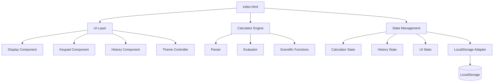
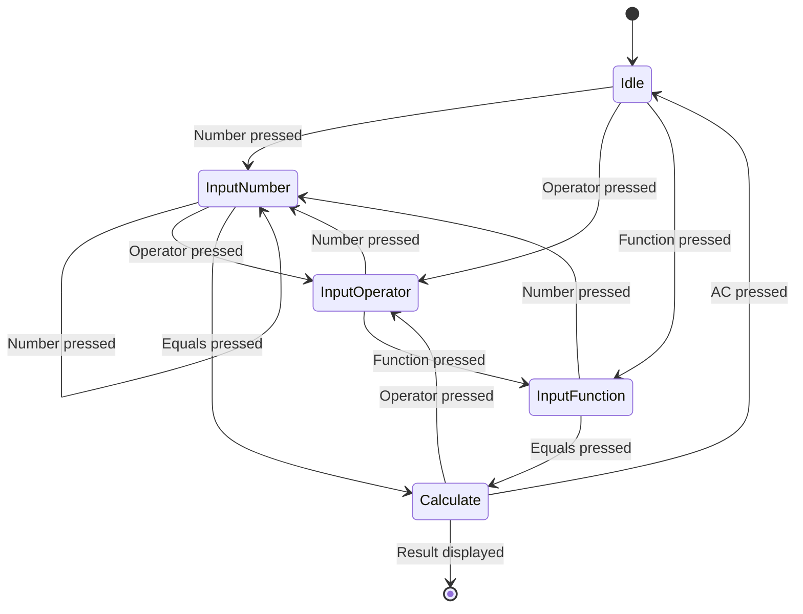

# Technical Specification Document
# Scientific Calculator Web Application

## 1. Technology Stack Overview

### 1.1 Core Technologies

| Technology | Version | Purpose | Justification |
|------------|---------|---------|---------------|
| **HTML5** | Latest | Markup structure | Semantic, accessible, standard-compliant |
| **CSS3** | Latest | Styling | Modern layout capabilities, animations |
| **JavaScript** | ES6+ | Application logic | Native browser support, no build step required |
| **Tailwind CSS** | 3.x | UI framework | Rapid development, consistent design system |

### 1.2 External Dependencies

#### 1.2.1 CDN Resources
```html
<!-- Tailwind CSS with plugins -->
<script src="https://cdn.tailwindcss.com?plugins=forms,container-queries"></script>

<!-- Google Fonts -->
<link href="https://fonts.googleapis.com/css2?family=Space+Grotesk:wght@300;400;500;600;700&family=Noto+Sans:wght@400;500;700&display=swap" rel="stylesheet">

<!-- Material Symbols Icons -->
<link href="https://fonts.googleapis.com/css2?family=Material+Symbols+Outlined:wght,FILL@100..700,0..1&display=swap" rel="stylesheet">
```

#### 1.2.2 No Build Tools Required
- **Rationale**: Simplicity, quick deployment, no compilation step
- **Trade-off**: Larger initial bundle size, no tree-shaking
- **Mitigation**: Use CDN caching, defer non-critical resources

---

## 2. Architecture Design

### 2.1 Application Architecture



### 2.2 Module Structure

```
calculator-app/
├── index.html              # Main HTML file
├── css/
│   └── styles.css         # Custom CSS (minimal, Tailwind overrides)
├── js/
│   ├── main.js            # Application entry point
│   ├── calculator.js      # Calculator engine
│   ├── display.js         # Display management
│   ├── history.js         # History management
│   ├── theme.js           # Theme controller
│   └── utils.js           # Utility functions
├── docs/
│   ├── PRD.md
│   └── TechSpec.md
└── README.md
```

### 2.3 Component Responsibilities

#### 2.3.1 UI Layer (`display.js`)
- Render current expression
- Render calculation result
- Format numbers (thousand separators, decimals)
- Update display on state changes
- Handle display animations

#### 2.3.2 Calculator Engine (`calculator.js`)
- Parse mathematical expressions
- Evaluate expressions
- Handle operator precedence
- Execute scientific functions
- Manage calculation state
- Error handling

#### 2.3.3 History Manager (`history.js`)
- Store calculation history
- Retrieve history items
- Clear history
- Persist to localStorage
- Render history UI
- Handle history item clicks

#### 2.3.4 Theme Controller (`theme.js`)
- Toggle between light/dark modes
- Persist theme preference
- Apply theme classes to DOM
- Initialize theme on load

#### 2.3.5 Main Controller (`main.js`)
- Initialize application
- Set up event listeners
- Coordinate between modules
- Handle keyboard input (future)

---

## 3. Data Models

### 3.1 Calculator State

```typescript
interface CalculatorState {
  currentExpression: string;      // "1250 + 500"
  currentResult: number | null;   // 1750
  lastOperator: string | null;    // "+"
  pendingValue: number | null;    // 500
  isNewCalculation: boolean;      // false
  hasError: boolean;              // false
  errorMessage: string | null;    // null
}
```

### 3.2 History Item

```typescript
interface HistoryItem {
  id: string;                     // UUID
  expression: string;             // "1250 + 500"
  result: number;                 // 1750
  timestamp: number;              // Unix timestamp
  formattedExpression: string;    // "1,250 + 500"
  formattedResult: string;        // "1,750"
}
```

### 3.3 Application Settings

```typescript
interface AppSettings {
  theme: 'light' | 'dark';
  angleUnit: 'degrees' | 'radians';  // Future
  decimalPlaces: number;              // Future
  maxHistoryItems: number;            // Default: 50
}
```

### 3.4 LocalStorage Schema

```typescript
interface StorageData {
  version: string;                // "1.0.0"
  history: HistoryItem[];
  settings: AppSettings;
  lastUpdated: number;            // Unix timestamp
}
```

**Storage Key**: `scientific-calculator-data`

---

## 4. Calculator Engine Specification

### 4.1 Expression Parser

#### 4.1.1 Tokenization
- Split expression into tokens (numbers, operators, functions)
- Handle decimal numbers
- Recognize scientific notation (future)
- Support parentheses (future)

#### 4.1.2 Operator Precedence
```javascript
const PRECEDENCE = {
  '+': 1,
  '−': 1,
  '×': 2,
  '÷': 2,
  '%': 2,
  '^': 3  // Future: exponentiation
};
```

#### 4.1.3 Expression Validation
- Check for balanced parentheses
- Validate operator placement
- Prevent consecutive operators
- Check for empty expressions

### 4.2 Scientific Functions Implementation

#### 4.2.1 Trigonometric Functions
```javascript
const scientificFunctions = {
  sin: (x, angleUnit = 'degrees') => {
    const rad = angleUnit === 'degrees' ? x * Math.PI / 180 : x;
    return Math.sin(rad);
  },
  
  cos: (x, angleUnit = 'degrees') => {
    const rad = angleUnit === 'degrees' ? x * Math.PI / 180 : x;
    return Math.cos(rad);
  },
  
  tan: (x, angleUnit = 'degrees') => {
    const rad = angleUnit === 'degrees' ? x * Math.PI / 180 : x;
    return Math.tan(rad);
  },
  
  ln: (x) => {
    if (x <= 0) throw new Error('Invalid input for ln');
    return Math.log(x);
  },
  
  sqrt: (x) => {
    if (x < 0) throw new Error('Cannot calculate square root of negative number');
    return Math.sqrt(x);
  }
};
```

#### 4.2.2 Constants
```javascript
const CONSTANTS = {
  PI: Math.PI,
  E: Math.E  // Future
};
```

### 4.3 Number Formatting

#### 4.3.1 Display Formatting
```javascript
function formatNumber(num) {
  // Handle special cases
  if (!isFinite(num)) return 'Error';
  if (num === 0) return '0';
  
  // Format with thousand separators
  const parts = num.toString().split('.');
  parts[0] = parts[0].replace(/\B(?=(\d{3})+(?!\d))/g, ',');
  
  // Limit decimal places for display
  if (parts[1] && parts[1].length > 10) {
    parts[1] = parts[1].substring(0, 10);
  }
  
  return parts.join('.');
}
```

#### 4.3.2 Precision Handling
- Use IEEE 754 double precision (JavaScript default)
- Round to 10 decimal places for display
- Preserve full precision in calculations
- Handle floating-point errors (e.g., 0.1 + 0.2)

### 4.4 Error Handling

```javascript
const ERROR_TYPES = {
  DIVISION_BY_ZERO: 'Cannot divide by zero',
  INVALID_OPERATION: 'Invalid operation',
  MATH_ERROR: 'Math error',
  SYNTAX_ERROR: 'Syntax error',
  OVERFLOW: 'Number too large',
  UNDERFLOW: 'Number too small'
};
```

---

## 5. UI/UX Implementation

### 5.1 Tailwind Configuration

```javascript
tailwind.config = {
  darkMode: "class",
  theme: {
    extend: {
      colors: {
        "primary": "#2b7cee",
        "background-light": "#f6f7f8",
        "background-dark": "#101822",
      },
      fontFamily: {
        "display": ["Space Grotesk", "sans-serif"],
        "body": ["Noto Sans", "sans-serif"],
      },
      borderRadius: {
        DEFAULT: "0.25rem",
        lg: "0.5rem",
        xl: "0.75rem",
        "2xl": "1rem",
        full: "9999px"
      },
    },
  },
}
```

### 5.2 Animation Specifications

#### 5.2.1 Button Interactions
```css
/* Hover effect */
.btn-hover {
  transition: background-color 200ms ease-in-out;
}

/* Active/pressed effect */
.btn-active {
  transform: scale(0.95);
  transition: transform 100ms ease-out;
}

/* Ripple effect (future enhancement) */
.btn-ripple {
  position: relative;
  overflow: hidden;
}
```

#### 5.2.2 History Item Animations
```css
.history-item {
  opacity: 0.6;
  transition: opacity 200ms ease-in-out;
}

.history-item:hover {
  opacity: 1;
}
```

#### 5.2.3 Theme Transition
```css
* {
  transition: background-color 300ms ease-in-out,
              color 300ms ease-in-out,
              border-color 300ms ease-in-out;
}
```

### 5.3 Responsive Breakpoints

```css
/* Mobile-first approach */
/* Default: 320px - 447px (mobile) */

/* Tablet: 448px+ */
@media (min-width: 448px) {
  .calculator-container {
    max-width: 448px;
    margin: 0 auto;
    box-shadow: 0 20px 60px rgba(0, 0, 0, 0.1);
  }
}

/* Desktop: 1024px+ */
@media (min-width: 1024px) {
  /* Center calculator, add background pattern */
}
```

### 5.4 Custom Scrollbar

```css
.history-scroll::-webkit-scrollbar {
  width: 6px;
}

.history-scroll::-webkit-scrollbar-track {
  background: transparent;
}

.history-scroll::-webkit-scrollbar-thumb {
  background-color: rgba(156, 163, 175, 0.5);
  border-radius: 20px;
}

.history-scroll::-webkit-scrollbar-thumb:hover {
  background-color: rgba(156, 163, 175, 0.7);
}
```

---

## 6. State Management

### 6.1 State Flow Diagram



### 6.2 State Management Pattern

```javascript
class CalculatorState {
  constructor() {
    this.state = this.getInitialState();
    this.listeners = [];
  }
  
  getInitialState() {
    return {
      currentExpression: '',
      currentResult: null,
      lastOperator: null,
      pendingValue: null,
      isNewCalculation: true,
      hasError: false,
      errorMessage: null
    };
  }
  
  setState(updates) {
    this.state = { ...this.state, ...updates };
    this.notifyListeners();
  }
  
  subscribe(listener) {
    this.listeners.push(listener);
    return () => {
      this.listeners = this.listeners.filter(l => l !== listener);
    };
  }
  
  notifyListeners() {
    this.listeners.forEach(listener => listener(this.state));
  }
  
  reset() {
    this.setState(this.getInitialState());
  }
}
```

### 6.3 LocalStorage Integration

```javascript
class StorageAdapter {
  static STORAGE_KEY = 'scientific-calculator-data';
  static VERSION = '1.0.0';
  
  static save(data) {
    try {
      const storageData = {
        version: this.VERSION,
        ...data,
        lastUpdated: Date.now()
      };
      localStorage.setItem(this.STORAGE_KEY, JSON.stringify(storageData));
      return true;
    } catch (error) {
      console.error('Failed to save to localStorage:', error);
      return false;
    }
  }
  
  static load() {
    try {
      const data = localStorage.getItem(this.STORAGE_KEY);
      if (!data) return null;
      
      const parsed = JSON.parse(data);
      
      // Version migration logic
      if (parsed.version !== this.VERSION) {
        return this.migrate(parsed);
      }
      
      return parsed;
    } catch (error) {
      console.error('Failed to load from localStorage:', error);
      return null;
    }
  }
  
  static clear() {
    localStorage.removeItem(this.STORAGE_KEY);
  }
  
  static migrate(oldData) {
    // Handle version migrations
    return oldData;
  }
}
```

---

## 7. Event Handling

### 7.1 Button Event Handlers

```javascript
const eventHandlers = {
  // Number buttons (0-9, .)
  handleNumber(digit) {
    if (state.isNewCalculation) {
      state.currentExpression = digit;
      state.isNewCalculation = false;
    } else {
      state.currentExpression += digit;
    }
    updateDisplay();
  },
  
  // Operator buttons (+, −, ×, ÷)
  handleOperator(operator) {
    if (state.currentExpression) {
      state.currentExpression += ` ${operator} `;
      state.lastOperator = operator;
    }
    updateDisplay();
  },
  
  // Scientific function buttons
  handleFunction(func) {
    const value = parseFloat(state.currentExpression);
    if (isNaN(value)) return;
    
    try {
      const result = scientificFunctions[func](value);
      state.currentExpression = `${func}(${value})`;
      state.currentResult = result;
      updateDisplay();
    } catch (error) {
      handleError(error);
    }
  },
  
  // Equals button
  handleEquals() {
    try {
      const result = evaluateExpression(state.currentExpression);
      addToHistory(state.currentExpression, result);
      state.currentResult = result;
      state.isNewCalculation = true;
      updateDisplay();
    } catch (error) {
      handleError(error);
    }
  },
  
  // Clear button (AC)
  handleClear() {
    state.reset();
    updateDisplay();
  },
  
  // Backspace button
  handleBackspace() {
    state.currentExpression = state.currentExpression.slice(0, -1);
    updateDisplay();
  },
  
  // Sign toggle (±)
  handleSignToggle() {
    const value = parseFloat(state.currentExpression);
    if (!isNaN(value)) {
      state.currentExpression = (-value).toString();
      updateDisplay();
    }
  },
  
  // Percentage button
  handlePercentage() {
    const value = parseFloat(state.currentExpression);
    if (!isNaN(value)) {
      state.currentExpression = (value / 100).toString();
      updateDisplay();
    }
  }
};
```

### 7.2 Keyboard Support (Future Enhancement)

```javascript
const keyboardMap = {
  '0-9': 'handleNumber',
  '.': 'handleNumber',
  '+': 'handleOperator',
  '-': 'handleOperator',
  '*': 'handleOperator',
  '/': 'handleOperator',
  'Enter': 'handleEquals',
  '=': 'handleEquals',
  'Escape': 'handleClear',
  'Backspace': 'handleBackspace',
  'Delete': 'handleBackspace'
};
```

---

## 8. Performance Optimization

### 8.1 Rendering Optimization

```javascript
// Debounce display updates
const updateDisplay = debounce(() => {
  displayElement.textContent = formatNumber(state.currentResult);
  expressionElement.textContent = state.currentExpression;
}, 16); // ~60fps

// Virtual scrolling for history (if > 100 items)
function renderVisibleHistory() {
  const scrollTop = historyContainer.scrollTop;
  const containerHeight = historyContainer.clientHeight;
  const itemHeight = 60; // Approximate height
  
  const startIndex = Math.floor(scrollTop / itemHeight);
  const endIndex = Math.ceil((scrollTop + containerHeight) / itemHeight);
  
  // Render only visible items
  renderHistoryItems(startIndex, endIndex);
}
```

### 8.2 Memory Management

```javascript
// Limit history size
const MAX_HISTORY_ITEMS = 50;

function addToHistory(expression, result) {
  history.unshift({ expression, result, timestamp: Date.now() });
  
  if (history.length > MAX_HISTORY_ITEMS) {
    history = history.slice(0, MAX_HISTORY_ITEMS);
  }
  
  StorageAdapter.save({ history, settings });
}
```

### 8.3 Lazy Loading

```javascript
// Load history on demand
let historyLoaded = false;

function loadHistory() {
  if (historyLoaded) return;
  
  const data = StorageAdapter.load();
  if (data && data.history) {
    history = data.history;
    renderHistory();
  }
  
  historyLoaded = true;
}

// Load when history section is visible
historyContainer.addEventListener('scroll', () => {
  loadHistory();
}, { once: true });
```

---

## 9. Testing Strategy

> [!IMPORTANT]
> **자동화 테스트 범위**: 코어 로직만 (계산 엔진, 상태 관리, 히스토리, 스토리지)
> 
> **수동 테스트 범위**: UI 및 사용자 인터랙션

### 9.1 Unit Testing (자동화)

```javascript
// 코어 로직 테스트
describe('Calculator Engine', () => {
  test('Basic arithmetic', () => {
    expect(evaluate('2 + 2')).toBe(4);
    expect(evaluate('10 - 5')).toBe(5);
    expect(evaluate('3 × 4')).toBe(12);
    expect(evaluate('15 ÷ 3')).toBe(5);
  });
  
  test('Scientific functions', () => {
    expect(scientificFunctions.sin(30)).toBeCloseTo(0.5);
    expect(scientificFunctions.cos(0)).toBe(1);
    expect(scientificFunctions.ln(Math.E)).toBeCloseTo(1);
    expect(scientificFunctions.sqrt(16)).toBe(4);
  });
  
  test('Error handling', () => {
    expect(() => evaluate('5 ÷ 0')).toThrow('Cannot divide by zero');
    expect(() => scientificFunctions.ln(-1)).toThrow();
    expect(() => scientificFunctions.sqrt(-4)).toThrow();
  });
});
```

### 9.2 Integration Testing (자동화)

```javascript
// 코어 로직 통합 테스트
describe('Core Logic Integration', () => {
  test('Calculator with History', () => {
    const calc = new Calculator();
    const history = new HistoryManager();
    
    const result = calc.calculate('2 + 3');
    history.add({ expression: '2 + 3', result });
    
    expect(result).toBe(5);
    expect(history.getAll()).toHaveLength(1);
  });
  
  test('State management', () => {
    const state = new CalculatorState();
    state.setState({ currentExpression: '2 + 3' });
    
    expect(state.state.currentExpression).toBe('2 + 3');
  });
});
```

### 9.3 Manual Testing Checklist (수동)

- [ ] All number buttons work correctly
- [ ] All operator buttons work correctly
- [ ] All scientific functions work correctly
- [ ] AC button clears calculator
- [ ] Backspace removes last character
- [ ] Equals button calculates result
- [ ] History displays correctly
- [ ] History items are clickable
- [ ] Clear History button works
- [ ] Theme toggle works
- [ ] Dark mode displays correctly
- [ ] Light mode displays correctly
- [ ] Responsive on mobile devices
- [ ] Responsive on tablets
- [ ] Responsive on desktop
- [ ] LocalStorage persists data
- [ ] Error states display correctly
- [ ] Animations are smooth

---

## 10. Security Considerations

### 10.1 Input Validation

```javascript
// Sanitize user input
function sanitizeInput(input) {
  // Remove any non-mathematical characters
  return input.replace(/[^0-9+\-×÷().πe\s]/g, '');
}

// Prevent code injection
function safeEvaluate(expression) {
  // Never use eval() directly
  // Use custom parser instead
  return parseAndEvaluate(expression);
}
```

### 10.2 LocalStorage Security

- No sensitive data stored
- Data is user-specific (calculations only)
- No authentication required
- Clear data option available

### 10.3 XSS Prevention

```javascript
// Escape HTML in display
function escapeHTML(str) {
  const div = document.createElement('div');
  div.textContent = str;
  return div.innerHTML;
}

// Use textContent instead of innerHTML
displayElement.textContent = result;
```

---

## 11. Browser Compatibility

### 11.1 Supported Browsers

| Browser | Minimum Version | Notes |
|---------|----------------|-------|
| Chrome | 90+ | Full support |
| Firefox | 88+ | Full support |
| Safari | 14+ | Full support |
| Edge | 90+ | Full support |
| iOS Safari | 14+ | Full support |
| Chrome Mobile | 90+ | Full support |

### 11.2 Polyfills (if needed)

```javascript
// Math functions (already supported in modern browsers)
// No polyfills required for target browsers

// LocalStorage fallback
if (!window.localStorage) {
  console.warn('LocalStorage not supported. History will not persist.');
  // Implement in-memory fallback
}
```

### 11.3 Progressive Enhancement

- Core functionality works without JavaScript (static display)
- Enhanced features require JavaScript
- Graceful degradation for older browsers

---

## 12. Deployment

### 12.1 Build Process

**No build required** - Static files can be deployed directly

```bash
# Optional: Minify for production
npx html-minifier index.html -o dist/index.html
npx terser js/*.js -o dist/app.min.js
```

### 12.2 Hosting Options

1. **GitHub Pages** (Recommended for MVP)
   - Free hosting
   - Automatic HTTPS
   - Easy deployment via git push

2. **Netlify**
   - Free tier available
   - Automatic deployments
   - CDN included

3. **Vercel**
   - Free for personal projects
   - Fast global CDN
   - Easy setup

### 12.3 Deployment Checklist

- [ ] Minify HTML, CSS, JS (optional)
- [ ] Optimize images
- [ ] Set up CDN for static assets
- [ ] Configure caching headers
- [ ] Test on production environment
- [ ] Set up analytics (optional)
- [ ] Configure custom domain (optional)
- [ ] Enable HTTPS
- [ ] Test on multiple devices
- [ ] Verify all features work in production

---

## 13. Monitoring & Analytics

### 13.1 Performance Monitoring

```javascript
// Measure key metrics
const performanceMetrics = {
  loadTime: performance.timing.loadEventEnd - performance.timing.navigationStart,
  domReady: performance.timing.domContentLoadedEventEnd - performance.timing.navigationStart,
  firstPaint: performance.getEntriesByType('paint')[0]?.startTime
};

console.log('Performance Metrics:', performanceMetrics);
```

### 13.2 Error Tracking

```javascript
// Global error handler
window.addEventListener('error', (event) => {
  console.error('Global error:', event.error);
  // Send to error tracking service (optional)
});

// Unhandled promise rejections
window.addEventListener('unhandledrejection', (event) => {
  console.error('Unhandled rejection:', event.reason);
});
```

### 13.3 Usage Analytics (Optional)

```javascript
// Track calculator usage
function trackEvent(category, action, label) {
  // Google Analytics, Plausible, or custom analytics
  if (window.gtag) {
    gtag('event', action, {
      event_category: category,
      event_label: label
    });
  }
}

// Example usage
trackEvent('Calculator', 'calculation', 'basic_arithmetic');
trackEvent('Calculator', 'function_used', 'sin');
```

---

## 14. Future Technical Enhancements

### 14.1 Phase 2 Technical Features

- **Service Worker**: Offline functionality
- **PWA**: Installable web app
- **Web Workers**: Heavy calculations in background thread
- **IndexedDB**: More robust storage for large history

### 14.2 Phase 3 Technical Features

- **WebAssembly**: High-performance math engine
- **Canvas/WebGL**: Graphing capabilities
- **Web Speech API**: Voice input
- **Clipboard API**: Copy/paste support

### 14.3 Advanced Optimizations

- Code splitting
- Lazy loading modules
- Image optimization (if icons used)
- Critical CSS inlining
- Resource hints (preconnect, prefetch)

---

## 15. Development Workflow

### 15.1 Local Development

```bash
# Clone repository
git clone https://github.com/nohyujin/calculator-app.git
cd calculator-app

# Open in browser
# Option 1: Use VS Code Live Server extension
# Option 2: Use Python simple server
python -m http.server 8000

# Option 3: Use Node.js http-server
npx http-server -p 8000
```

### 15.2 Version Control

```bash
# Git workflow
git checkout -b feature/calculator-engine
# Make changes
git add .
git commit -m "feat: implement calculator engine"
git push origin feature/calculator-engine
# Create pull request
```

### 15.3 Code Quality Tools

```json
// .eslintrc.json (optional)
{
  "env": {
    "browser": true,
    "es2021": true
  },
  "extends": "eslint:recommended",
  "parserOptions": {
    "ecmaVersion": 12,
    "sourceType": "module"
  },
  "rules": {
    "no-eval": "error",
    "no-implied-eval": "error",
    "prefer-const": "warn"
  }
}
```

---

## 16. Appendix

### 16.1 Mathematical Formulas

```javascript
// Operator precedence algorithm (Shunting Yard)
// Scientific function implementations
// Number formatting algorithms
```

### 16.2 Code Style Guide

- Use ES6+ features (const, let, arrow functions)
- Prefer functional programming patterns
- Use meaningful variable names
- Comment complex logic
- Follow Airbnb JavaScript Style Guide

### 16.3 Resources

- [MDN Web Docs - Math](https://developer.mozilla.org/en-US/docs/Web/JavaScript/Reference/Global_Objects/Math)
- [Tailwind CSS Documentation](https://tailwindcss.com/docs)
- [Material Symbols](https://fonts.google.com/icons)
- [Web.dev Performance](https://web.dev/performance/)

### 16.4 Document History

- **Version 1.0** - Initial Tech Spec
- **Date**: 2025-12-24
- **Author**: Engineering Team
