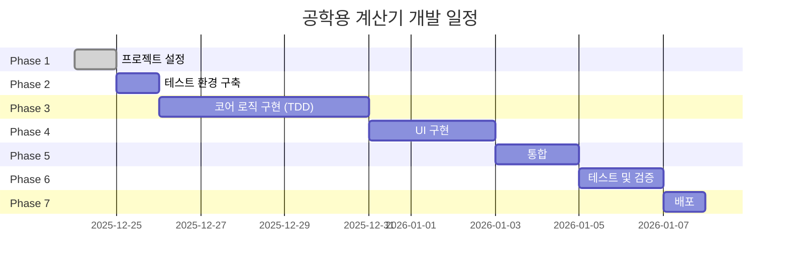
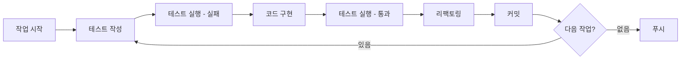

# 공학용 계산기 구현 계획

## 📅 프로젝트 타임라인



**예상 총 개발 기간**: 약 2주

---

## 🎯 Phase별 상세 계획

### Phase 1: 프로젝트 초기 설정 (완료 ✅)

**목표**: 프로젝트 기반 구축 및 문서화

**완료 항목**:
- ✅ 프로젝트 구조 생성
- ✅ GitHub 저장소 연결
- ✅ CI/CD 파이프라인 설정
- ✅ 기술 문서 작성 (PRD, TechSpec, TDD, SOLID)
- ✅ 배포 가이드 작성

**산출물**:
- README.md
- docs/PRD.md
- docs/TechSpec.md
- docs/TDD규칙.md
- docs/SOLID원칙.md
- docs/배포가이드.md
- .github/workflows/deploy.yml

---

### Phase 2: 테스트 환경 구축

**목표**: TDD를 위한 테스트 인프라 구축

**예상 소요 시간**: 1일

**작업 순서**:

1. **Node.js 프로젝트 초기화**
   ```bash
   npm init -y
   ```

2. **Jest 설치**
   ```bash
   npm install --save-dev jest @types/jest
   npm install --save-dev @testing-library/dom
   ```

3. **Jest 설정 파일 작성**
   ```javascript
   // jest.config.js
   module.exports = {
     testEnvironment: 'jsdom',
     roots: ['<rootDir>/tests'],
     testMatch: ['**/*.test.js'],
     collectCoverageFrom: [
       'src/**/*.js',
       '!src/display.js',
       '!src/theme.js',
       '!src/main.js'
     ],
     coverageThreshold: {
       global: {
         branches: 80,
         functions: 90,
         lines: 90,
         statements: 90
       }
     }
   };
   ```

4. **디렉토리 구조 생성**
   ```
   src/
   ├── core/
   │   ├── calculator.js
   │   ├── operations/
   │   └── scientific/
   ├── state/
   ├── storage/
   ├── history/
   └── utils/
   
   tests/
   ├── core/
   ├── state/
   ├── storage/
   ├── history/
   └── utils/
   ```

5. **package.json 스크립트 추가**
   ```json
   {
     "scripts": {
       "test": "jest",
       "test:watch": "jest --watch",
       "test:coverage": "jest --coverage"
     }
   }
   ```

**검증 기준**:
- [ ] `npm test` 실행 가능
- [ ] 샘플 테스트 통과
- [ ] 커버리지 리포트 생성

---

### Phase 3: 코어 로직 구현 (TDD)

**목표**: 계산기의 핵심 비즈니스 로직을 TDD로 구현

**예상 소요 시간**: 5일

**개발 순서** (의존성 순서):

#### Day 1: 유틸리티 및 기본 연산

**오전**:
1. `utils.js` - 숫자 포맷팅
   - 테스트 작성 → 구현 → 리팩토링
   - formatNumber, validateNumber, roundToPrecision

**오후**:
2. `operations/base.js` - 연산 인터페이스
3. `operations/addition.js` - 덧셈
4. `operations/subtraction.js` - 뺄셈

**산출물**:
- src/utils.js
- tests/utils.test.js
- src/core/operations/base.js
- src/core/operations/addition.js
- tests/core/operations/addition.test.js
- src/core/operations/subtraction.js
- tests/core/operations/subtraction.test.js

#### Day 2: 기본 연산 완성 및 과학 함수 시작

**오전**:
1. `operations/multiplication.js` - 곱셈
2. `operations/division.js` - 나눗셈 (0으로 나누기 에러 포함)

**오후**:
3. `scientific/base.js` - 과학 함수 인터페이스
4. `scientific/sin.js` - 사인 함수
5. `scientific/cos.js` - 코사인 함수

**산출물**:
- src/core/operations/multiplication.js
- src/core/operations/division.js
- src/core/scientific/base.js
- src/core/scientific/sin.js
- src/core/scientific/cos.js
- 각각의 테스트 파일

#### Day 3: 과학 함수 완성 및 레지스트리

**오전**:
1. `scientific/tan.js` - 탄젠트
2. `scientific/ln.js` - 자연로그
3. `scientific/sqrt.js` - 제곱근

**오후**:
4. `core/operation-registry.js` - 연산 레지스트리
   - 연산 등록/조회 기능
   - OCP 원칙 적용

**산출물**:
- src/core/scientific/tan.js
- src/core/scientific/ln.js
- src/core/scientific/sqrt.js
- src/core/operation-registry.js
- 각각의 테스트 파일

#### Day 4: 계산 엔진 및 상태 관리

**오전**:
1. `core/expression-parser.js` - 표현식 파싱
   - 토큰화
   - 연산자 우선순위 처리

**오후**:
2. `core/calculator.js` - 계산기 엔진
   - 표현식 평가
   - 에러 처리
3. `state/calculator-state.js` - 상태 관리
   - Observer 패턴 적용

**산출물**:
- src/core/expression-parser.js
- src/core/calculator.js
- src/state/calculator-state.js
- 각각의 테스트 파일

#### Day 5: 히스토리 및 스토리지

**오전**:
1. `storage/storage-interface.js` - 스토리지 인터페이스 (DIP)
2. `storage/local-storage-adapter.js` - LocalStorage 구현

**오후**:
3. `history/history-manager.js` - 히스토리 관리
   - 추가/조회/삭제
   - 최대 개수 제한
4. **통합 테스트** - 전체 플로우 테스트

**산출물**:
- src/storage/storage-interface.js
- src/storage/local-storage-adapter.js
- src/history/history-manager.js
- tests/integration/ (통합 테스트)

**Phase 3 검증 기준**:
- [ ] 모든 단위 테스트 통과
- [ ] 코드 커버리지 90% 이상
- [ ] 통합 테스트 통과
- [ ] SOLID 원칙 준수 확인

---

### Phase 4: UI 구현

**목표**: 사용자 인터페이스 구현

**예상 소요 시간**: 3일

#### Day 1: HTML 구조 및 기본 스타일

**작업**:
1. `index.html` 작성
   - 시맨틱 HTML 구조
   - CDN 링크 추가
   - Tailwind 설정
2. `css/styles.css` 작성
   - 커스텀 스타일
   - 스크롤바 스타일
   - 애니메이션

**검증**:
- [ ] HTML 유효성 검사
- [ ] 기본 레이아웃 표시
- [ ] 라이트/다크 모드 스타일 확인

#### Day 2: 컴포넌트 구현

**작업**:
1. 네비게이션 바
2. 히스토리 영역
3. 디스플레이 영역
4. 키패드 영역

**검증**:
- [ ] 모든 버튼 표시
- [ ] 반응형 레이아웃 동작
- [ ] 호버/클릭 효과 작동

#### Day 3: 테마 및 애니메이션

**작업**:
1. `src/ui/theme.js` - 테마 컨트롤러
2. 애니메이션 효과 추가
3. 반응형 디자인 최적화

**검증**:
- [ ] 테마 전환 작동
- [ ] 애니메이션 부드러움
- [ ] 모바일 최적화 확인

---

### Phase 5: UI와 로직 통합

**목표**: UI와 코어 로직 연결

**예상 소요 시간**: 2일

#### Day 1: 이벤트 핸들러 및 디스플레이

**작업**:
1. `src/ui/display.js` - 디스플레이 컨트롤러
2. `src/ui/event-handlers.js` - 이벤트 핸들러
   - 숫자/연산자 버튼
   - 과학 함수 버튼
   - 제어 버튼 (AC, Backspace, =)

**검증**:
- [ ] 버튼 클릭 시 표시 업데이트
- [ ] 계산 결과 정확성
- [ ] 에러 메시지 표시

#### Day 2: 히스토리 UI 및 메인 컨트롤러

**작업**:
1. `src/ui/history-ui.js` - 히스토리 UI
2. `src/main.js` - 메인 컨트롤러
   - 의존성 주입
   - 초기화 로직

**검증**:
- [ ] 히스토리 저장/표시
- [ ] 히스토리 클릭하여 재사용
- [ ] 전체 플로우 동작

---

### Phase 6: 테스트 및 검증

**목표**: 품질 보증 및 버그 수정

**예상 소요 시간**: 2일

> [!IMPORTANT]
> 이 단계에서는 **수동 테스트만** 진행합니다. UI 자동화 테스트는 작성하지 않습니다.

#### Day 1: 기능 테스트 (수동)

**수동 테스트 체크리스트**:
- [ ] 모든 기본 연산 테스트
- [ ] 모든 과학 함수 테스트
- [ ] 히스토리 기능 테스트
- [ ] 테마 전환 테스트
- [ ] 에러 케이스 테스트

**브라우저 테스트**:
- [ ] Chrome
- [ ] Firefox
- [ ] Safari
- [ ] Edge
- [ ] 모바일 브라우저

#### Day 2: 성능 및 접근성

**성능 테스트**:
- [ ] Lighthouse 점수 측정
- [ ] 로드 시간 측정
- [ ] 메모리 프로파일링

**접근성 테스트**:
- [ ] ARIA 레이블 확인
- [ ] 색상 대비 확인
- [ ] 키보드 네비게이션 (향후)

**버그 수정 및 최적화**

---

### Phase 7: 배포

**목표**: 프로덕션 배포

**예상 소요 시간**: 1일

**작업 순서**:

1. **배포 전 체크리스트**
   - [ ] 모든 테스트 통과
   - [ ] console.log 제거
   - [ ] 코드 리뷰 완료
   - [ ] 문서 업데이트

2. **배포**
   ```bash
   git add .
   git commit -m "feat: 공학용 계산기 v1.0.0"
   git push origin main
   ```

3. **배포 확인**
   - [ ] GitHub Actions 성공
   - [ ] 사이트 접속 확인
   - [ ] 모든 기능 동작 확인

4. **문서 업데이트**
   - [ ] README에 배포 URL 추가
   - [ ] 스크린샷 추가
   - [ ] 릴리즈 노트 작성

---

## 🔄 개발 워크플로우

### 일일 개발 루틴



### 커밋 메시지 컨벤션

```
feat: 새로운 기능 추가
fix: 버그 수정
test: 테스트 추가/수정
refactor: 리팩토링
docs: 문서 수정
style: 코드 포맷팅
chore: 빌드/설정 변경
```

**예시**:
```bash
git commit -m "test: Calculator 클래스 덧셈 테스트 추가"
git commit -m "feat: Calculator 클래스 덧셈 기능 구현"
git commit -m "refactor: Calculator 검증 로직 분리"
```

---

## 📊 품질 기준

### 코드 품질
- ✅ ESLint 규칙 준수
- ✅ 테스트 커버리지 90% 이상
- ✅ SOLID 원칙 준수
- ✅ 코드 리뷰 통과

### 성능 기준
- ✅ Lighthouse 성능 점수 90+
- ✅ 초기 로드 시간 < 2초
- ✅ 계산 응답 시간 < 100ms
- ✅ 60fps 애니메이션

### 접근성 기준
- ✅ WCAG 2.1 AA 준수
- ✅ 색상 대비 4.5:1 이상
- ✅ ARIA 레이블 적용
- ✅ 시맨틱 HTML 사용

---

## 🚨 리스크 관리

### 잠재적 리스크

| 리스크 | 영향도 | 대응 방안 |
|--------|--------|-----------|
| 부동소수점 정밀도 문제 | 높음 | roundToPrecision 함수로 처리 |
| 브라우저 호환성 | 중간 | 최신 브라우저만 지원, 폴리필 사용 |
| LocalStorage 용량 제한 | 낮음 | 히스토리 최대 50개 제한 |
| 복잡한 표현식 파싱 | 중간 | 초기 버전은 단순 표현식만 지원 |

---

## 📈 성공 지표

### 개발 완료 기준
- [ ] 모든 Phase 완료
- [ ] 테스트 커버리지 90% 이상
- [ ] 모든 기능 동작 확인
- [ ] 문서화 완료
- [ ] 배포 성공

### 품질 지표
- [ ] 버그 0개
- [ ] Lighthouse 점수 90+
- [ ] 모든 브라우저에서 동작
- [ ] 반응형 디자인 완벽 구현

---

## 📚 참고 자료

- [Jest 문서](https://jestjs.io/)
- [Tailwind CSS 문서](https://tailwindcss.com/)
- [MDN Web Docs](https://developer.mozilla.org/)
- [Clean Code - Robert C. Martin](https://www.amazon.com/Clean-Code-Handbook-Software-Craftsmanship/dp/0132350882)
